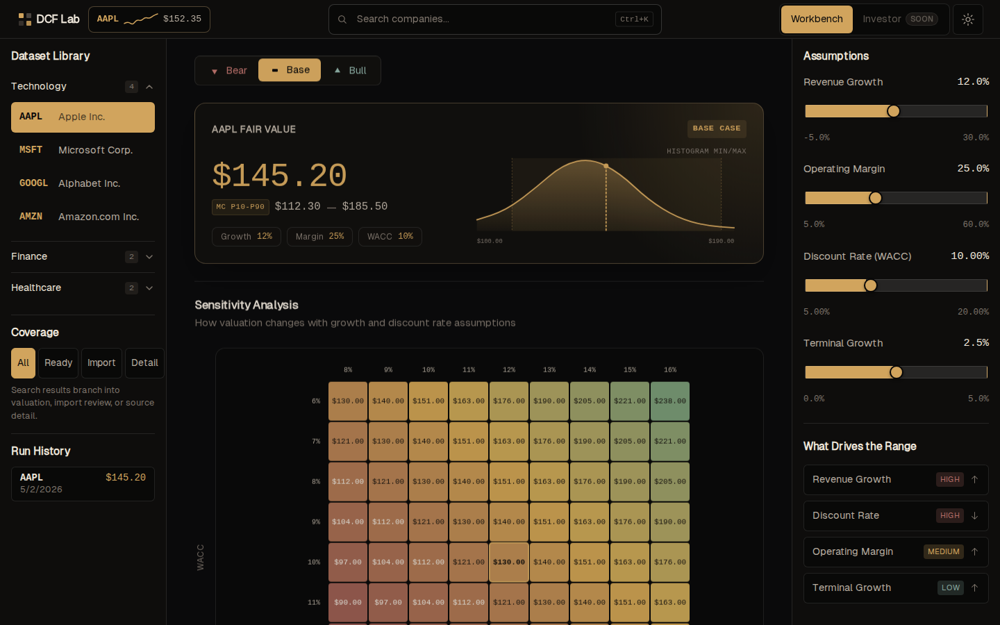
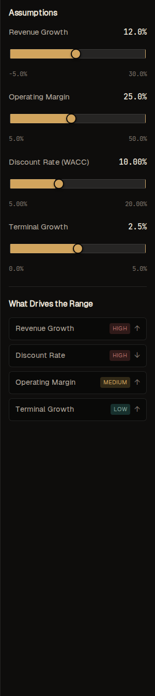
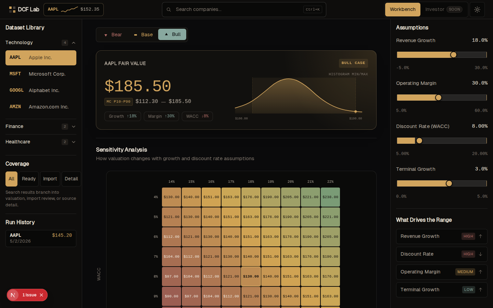

# DCF Dashboard

[](https://github.com/nostreet123/DCF-Dashboard/actions/workflows/ci.yml)
[](https://github.com/nostreet123/DCF-Dashboard/actions/workflows/codespell.yml)
[](https://github.com/nostreet123/DCF-Dashboard/actions/workflows/secret-scan.yml)
[](https://github.com/nostreet123/DCF-Dashboard/actions/workflows/codeql.yml)
[](LICENSE)

DCF Dashboard is an open-source valuation workbench that turns spreadsheet-style DCF analysis into reproducible browser workflows. It pairs a Next.js interface with a Python valuation engine, scenario comparison, optional Monte Carlo ranges, and optional Convex-backed persistence for saved runs and company facts.

**Documentation hub:** [`docs/README.md`](docs/README.md) · **First run:** [`docs/ONBOARDING.md`](docs/ONBOARDING.md)



## Who It Is For

- Learners and builders who want a reproducible DCF workflow instead of a one-off spreadsheet
- Contributors who care about transparent assumptions, tests, and safe public defaults
- Reviewers evaluating OSS readiness — not investors seeking trading signals

## Disclaimer

Outputs are for **financial modeling and education only**. They are not investment advice, recommendations, or guarantees of accuracy. Validate assumptions and data before relying on any estimate.

## Public Preview Boundary

This repository is **public-source ready**, not a hosted SaaS product. You can clone, demo, test, and deploy it yourself, but multi-tenant billing, org management, and production operations are out of scope unless you build them downstream.

What is in scope today: local/mock demos, direct compute, documented security defaults, and contributor verification (`npm run harness:verify`).

## Try It In Five Minutes

```bash
# optional if you use nvm
nvm use

npm ci

NEXT_PUBLIC_DCF_DASHBOARD_MODE=demo npm run dev
```

The demo mode is intentionally mock-backed: no Python service, Convex setup, SEC credentials, or AI provider key is required to open the workbench. For the direct engine smoke test, complete the full local setup below and run `npm run demo:compute`.

## What Problem It Solves

Most DCF workflows live in spreadsheets, scattered notes, and one-off scenario tabs. This project puts the core workflow into a reproducible app so you can:

- inspect a company-level fair value estimate
- compare base, bull, and bear cases
- stress-test growth and discount-rate assumptions
- review a Monte Carlo range instead of a single point estimate
- optionally persist and replay valuation runs through Convex

## Maintainer Signals

- Public-preview release notes: [`docs/releases/v0.1.0.md`](docs/releases/v0.1.0.md)
- Contribution guide: [`CONTRIBUTING.md`](CONTRIBUTING.md)
- Security policy: [`SECURITY.md`](SECURITY.md)
- Roadmap: [`ROADMAP.md`](ROADMAP.md)
- Deployment security runbook: [`DEPLOY_SECURITY_RUNBOOK.md`](DEPLOY_SECURITY_RUNBOOK.md)
- Canonical verification gate: `npm run harness:verify`
- Browser smoke gate: `npm run harness:e2e:smoke`

## Screenshots





## What Works Today

- Live EDGAR-backed dashboard mode by default when the Python service is configured
- Explicit mock-backed UI demo that needs only `NEXT_PUBLIC_DCF_DASHBOARD_MODE=demo`, with no external services or secrets required
- FastAPI compute service for direct DCF runs
- Base, bull, and bear scenario valuation output
- Sensitivity analysis and financial projection views
- Optional Monte Carlo summaries and mini-distribution plots
- Optional Convex persistence for saved runs, company facts, and replay flows
- Live global company search with coverage states for valuation-ready, import-required, and detail-only listings
- CSV/XLSX/PDF import review paths that preserve approved artifacts and facts through Convex when configured
- Server-only AI scenario analysis via Hugging Face configuration

## Prototype Vs. Stable

Stable enough for public preview:

- local install and smoke checks
- explicit mock demo mode
- direct compute flow
- public repo governance and security defaults

Still prototype / evolving:

- production deployment topology
- Convex-backed persistence setup for outside contributors
- broader data-source coverage beyond the current demo and sync flows
- long-term contributor workflows and triage volume

## Public Preview Security

Hosted public previews should use the documented secure defaults: keep local-only debug routes disabled, keep private service credentials on the server, and run the deployment checklist before exposing optional persistence or import workflows. See [`DEPLOY_SECURITY_RUNBOOK.md`](DEPLOY_SECURITY_RUNBOOK.md) and [`.env.example`](.env.example) for the operator-level details.

## Architecture At A Glance

- `app/`: Next.js workbench UI and API routes
- `python/dcf_engine/`: valuation engine and FastAPI service
- `convex/`: optional persistence, replay history, and sync-backed data paths
- `examples/`: sample request payloads for reproducible demos
- `docs/`: audit artifacts, roadmap, release notes, and showcase material

Persistence via Convex is optional. If you only want to demo the UI or run the compute engine locally, you do not need Convex configured. When enabled, Convex stores saved valuation runs and related facts so they can be replayed from the UI instead of recomputed ad hoc every time. The full setup path is documented in [`docs/convex-persistence.md`](docs/convex-persistence.md).

## Monte Carlo

Monte Carlo is an optional scenario-expansion layer on top of the base DCF run. It returns percentile summaries and histogram data so the UI can show a range of outcomes rather than a single point estimate. Modes are selected with the `mc` query parameter:

- `mc=fast`: 5,000 simulations
- `mc=default`: 25,000 simulations
- `mc=high`: 100,000 simulations
- `mc=off`: no Monte Carlo output

See [`docs/monte-carlo.md`](docs/monte-carlo.md) for how the simulation works and how to read the percentile summary and histogram.

## Web Feature Parity

The web app implements the Mac prototype parity surface as web-native routes and components. The Python DCF engine remains the valuation source of truth; Swift valuation code is not ported.

- Search uses `CoverageState` to branch listings into immediate valuation, import review, or source-detail views.
- Approved imports persist reviewed facts and artifact references in Convex, then compute from those facts immediately.
- Rich run output includes scenario values, KPIs, statement history, projections, sensitivity offsets, Monte Carlo summaries, and provenance.
- AI scenario analysis is server-only; provider credentials never go to the browser. Configuration guidance is documented in [`docs/ai-scenario-analysis.md`](docs/ai-scenario-analysis.md).
- Settings status reports integration readiness and active data mode.

The parity checklist lives in [`docs/web-feature-parity-checklist.md`](docs/web-feature-parity-checklist.md).

## Full Local Setup

```bash
# optional if you use nvm
nvm use

npm ci
python3 -m venv .venv
. .venv/bin/activate
python -m pip install --upgrade pip
python -m pip install -r python/requirements-dev.txt -c python/constraints.txt
```

Bun is used only as the test runner under the npm scripts. `npm` is the canonical JavaScript package manager for this repo.
If Bun is not installed globally, the repo harness installs the pinned Bun version into ignored `.bun-home/` automatically.

Fastest paths after install:

- Live EDGAR UI: follow the local engine path in [`docs/ONBOARDING.md`](docs/ONBOARDING.md)
- Mock UI demo: `NEXT_PUBLIC_DCF_DASHBOARD_MODE=demo npm run dev`
- Compute demo: `npm run demo:compute`
- Repo alive smoke check: `npm run smoke:alive`
- Agent/PR verification: `npm run harness:verify`

Full onboarding and golden paths: [`docs/ONBOARDING.md`](docs/ONBOARDING.md). Audit-grade verification logs: [`docs/public-repo-audit-phase3.md`](docs/public-repo-audit-phase3.md).

## Demo Paths

### Live EDGAR UI

This path starts the Python service and the Next.js app together for live data-backed local development. Use the step-by-step local instructions in [`docs/ONBOARDING.md`](docs/ONBOARDING.md), and keep local-only security overrides out of hosted environments.

For a UI-only mock demo without the Python service, run:

```bash
NEXT_PUBLIC_DCF_DASHBOARD_MODE=demo npm run dev
```

### Direct Compute Flow

Run `npm run demo:compute` after the full local setup to send the included sample payload through the Python valuation engine.

### Repo Alive Check

```bash
. .venv/bin/activate
npm run smoke:alive
```

### Agent / PR Verification

```bash
. .venv/bin/activate
npm run harness:verify
```

This runs repository invariant checks, Bun tests, pytest, production and test TypeScript typecheck, Convex typecheck, lint, and a production build. For a targeted browser smoke check, run `npm run harness:e2e:smoke`.

## Optional Services And Environment

Explicit UI-only demo mode works with `NEXT_PUBLIC_DCF_DASHBOARD_MODE=demo` and no external services or secrets. The default dashboard path is live and expects the Python service plus EDGAR configuration; optional services become relevant when you want persistence, replay history, or production-like service-to-service auth.

The most common environment variables — public-safe client values, operationally private values, and server-only secrets — are grouped in [`.env.example`](.env.example). Additional runtime knobs (e.g. API rate-limit caps) may be read from the environment without being listed there. Convex setup specifically is covered in [`docs/convex-persistence.md`](docs/convex-persistence.md).

## API Notes

The app exposes server routes for valuation previews, optional persistence, company lookup/import workflows, AI scenario analysis, and settings readiness. Keep optional persistence and import paths behind the documented server-side controls when deploying outside local development.

Security defaults are fail-closed for hosted deployments. Local-only escape hatches and the full rollout procedure are documented in [`DEPLOY_SECURITY_RUNBOOK.md`](DEPLOY_SECURITY_RUNBOOK.md).

## Tests

- `npm run harness:verify`
- `npm run harness:e2e:smoke`
- `npm test`
- `npm run typecheck:test`
- `npm run lint`
- `npm run build`
- `cd python && pytest`
- `npx convex typecheck`

E2E support is available through Playwright:

- install browsers once: `npm run test:e2e:install`
- run production-style flow: `npm run test:e2e`
- run mobile emulation: `npm run test:e2e:mobile`
- run local interactive UI mode: `npm run test:e2e:ui` (serves Playwright UI on loopback only at `http://127.0.0.1:9323`)

## Package Note

`package.json` sets `"private": true` so this app is **not published to npm**. The repository is still open source under the MIT license.

## Docs And Audit Trail

- **Docs hub:** [`docs/README.md`](docs/README.md)
- Onboarding: [`docs/ONBOARDING.md`](docs/ONBOARDING.md)
- OSS impact ledger: [`docs/oss-impact.md`](docs/oss-impact.md)
- OSS program application pack: [`docs/oss-program-application.md`](docs/oss-program-application.md)
- Public release checklist: [`docs/public-release-checklist.md`](docs/public-release-checklist.md)
- Architecture: [`docs/architecture.md`](docs/architecture.md)
- Provider/data flow: [`docs/provider-data-flow.md`](docs/provider-data-flow.md)
- Showcase: [`docs/showcase.md`](docs/showcase.md)
- Examples: [`examples/README.md`](examples/README.md)
- Contributing guide (incl. maintainer repo settings): [`CONTRIBUTING.md`](CONTRIBUTING.md)
- Support: [`SUPPORT.md`](SUPPORT.md) · Governance: [`GOVERNANCE.md`](GOVERNANCE.md) · Releasing: [`RELEASING.md`](RELEASING.md) · Third-party notices: [`THIRD_PARTY_NOTICES.md`](THIRD_PARTY_NOTICES.md)
- Roadmap: [`ROADMAP.md`](ROADMAP.md)
- Changelog: [`CHANGELOG.md`](CHANGELOG.md)
- Release notes: [`docs/releases/v0.1.0.md`](docs/releases/v0.1.0.md)
- OSS program reviewer pack: [`docs/oss-program-application.md`](docs/oss-program-application.md)
- Monte Carlo: [`docs/monte-carlo.md`](docs/monte-carlo.md)
- AI scenario analysis: [`docs/ai-scenario-analysis.md`](docs/ai-scenario-analysis.md)
- Convex persistence: [`docs/convex-persistence.md`](docs/convex-persistence.md)
- Data model: [`DATA_MODEL.md`](DATA_MODEL.md)
- Web feature parity: [`docs/web-feature-parity-checklist.md`](docs/web-feature-parity-checklist.md)
- Deploy/security runbook: [`DEPLOY_SECURITY_RUNBOOK.md`](DEPLOY_SECURITY_RUNBOOK.md)
- Public-repo audit trail: [phase 1](docs/public-repo-audit-phase1.md), [phase 2](docs/public-repo-audit-phase2.md), [phase 3](docs/public-repo-audit-phase3.md), [phases 4-7](docs/public-repo-audit-phase4-7.md)
