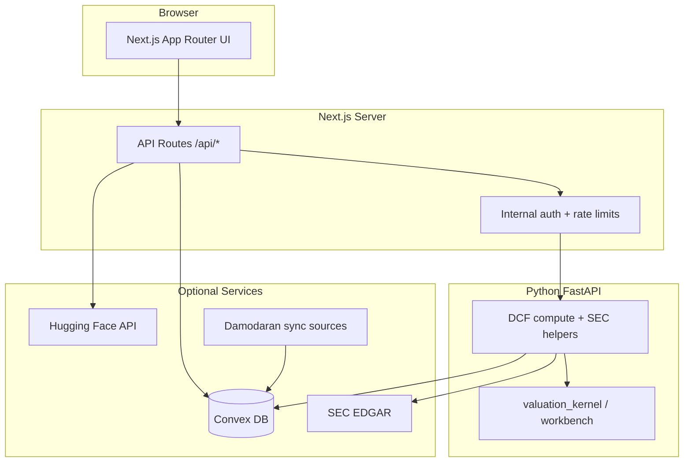

# Architecture

High-level view of DCF Dashboard for reviewers and contributors. Outputs are for **financial modeling and education only** — not investment advice.

## System Diagram

## Layers

| Layer | Location | Responsibility |
|-------|----------|----------------|
| UI | `app/`, `components/`, `lib/hooks/` | Workbench, search, scenarios, charts |
| API | `app/api/` | Auth, rate limits, proxies to engine and Convex |
| Engine | `python/dcf_engine/` | FCFF valuation, Monte Carlo, SEC-backed company routes |
| Persistence | `convex/` | Optional runs, imports, Damodaran snapshots, security state |
| Sync | `python/damodaran_sync/` | Optional Damodaran dataset ingestion |

## Request Paths

### Mock UI demo (no external services)

`NEXT_PUBLIC_DCF_DASHBOARD_MODE=demo` — browser uses bundled mock data; no Python engine or Convex required.

### Live valuation

1. Browser calls Next.js (`/api/dcf/preview` or `/api/dcf/run`).
2. Next.js signs requests to FastAPI when `DCF_ENGINE_INTERNAL_KEY` is set.
3. FastAPI runs `python/dcf_engine` workbench logic and may call SEC EDGAR for company data.
4. Optional: Next.js persists runs to Convex with server-side tokens.

### AI scenario analysis

Server-only route `POST /api/ai/scenario-analysis` — see [ai-scenario-analysis.md](./ai-scenario-analysis.md). Provider credentials never reach the browser.

## Deeper References

- Data model (hand-maintained): [DATA_MODEL.md](../DATA_MODEL.md)
- Convex flows and env vars: [convex-persistence.md](./convex-persistence.md)
- FCFF engine specification: [python/dcf_engine/docs/spec_fcff.md](../python/dcf_engine/docs/spec_fcff.md)
- External provider boundaries: [provider-data-flow.md](./provider-data-flow.md)
- Deploy security defaults: [DEPLOY_SECURITY_RUNBOOK.md](../DEPLOY_SECURITY_RUNBOOK.md)
