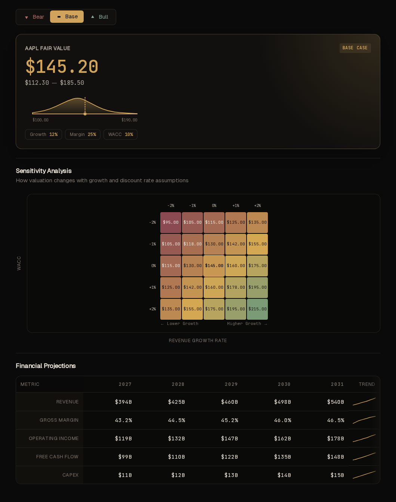

# Showcase

DCF Dashboard should be legible as a product, not only as source code. This page collects the first public-proof artifacts.

## Screenshots

### Homepage

### Assumptions Panel

### Example Valuation Flow

### Monte Carlo Output

## Example Use Case

One practical use case is a maintainer or analyst reviewing a company case with default assumptions, comparing base versus bull and bear cases, then checking whether the Monte Carlo distribution supports or challenges the point estimate before saving the run. The mock-backed UI proves the workflow quickly, while the direct compute demo shows the engine can also be exercised without the browser.

## Example Output

Sample request:

- [`examples/workbench-demo-request.json`](../examples/workbench-demo-request.json)

Sample output:

- [`examples/workbench-demo-output.json`](../examples/workbench-demo-output.json)

Representative values from the current sample output:

- Base fair value per share: `$21.01`
- Bull fair value per share: `$36.37`
- Bear fair value per share: `$11.81`
- Monte Carlo median: `$20.72`
- Monte Carlo p10 / p90: `$17.17 / $24.38`
