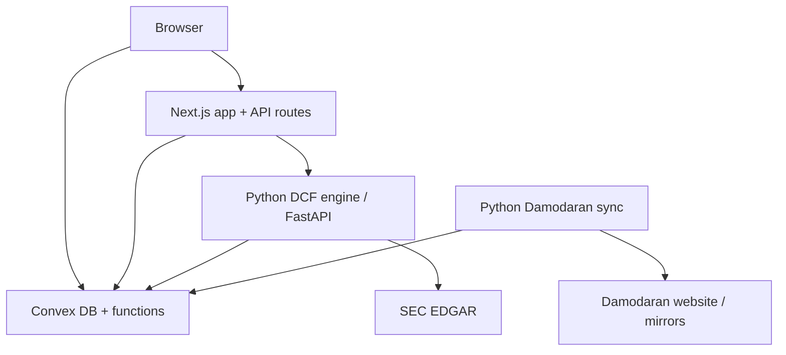
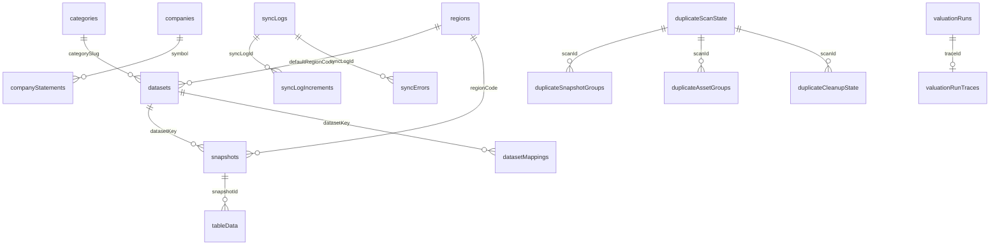
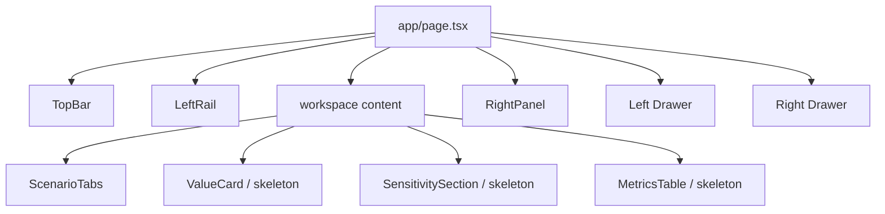
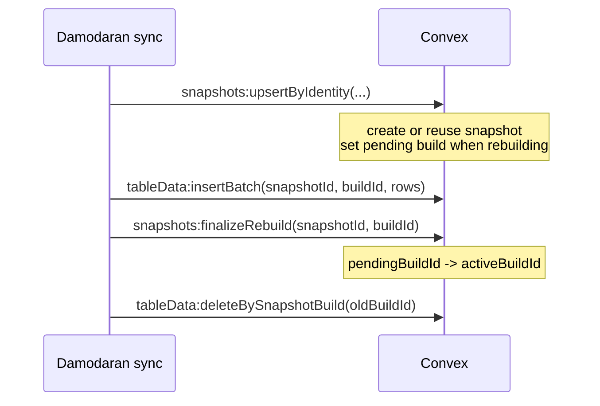
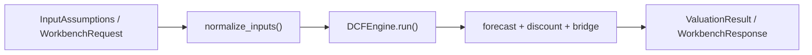
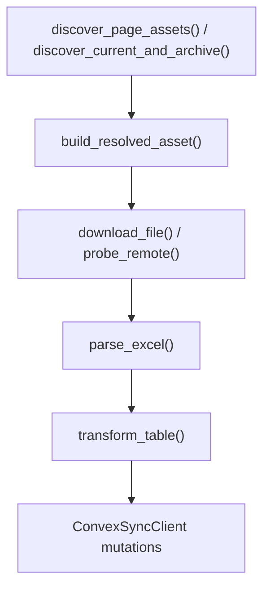
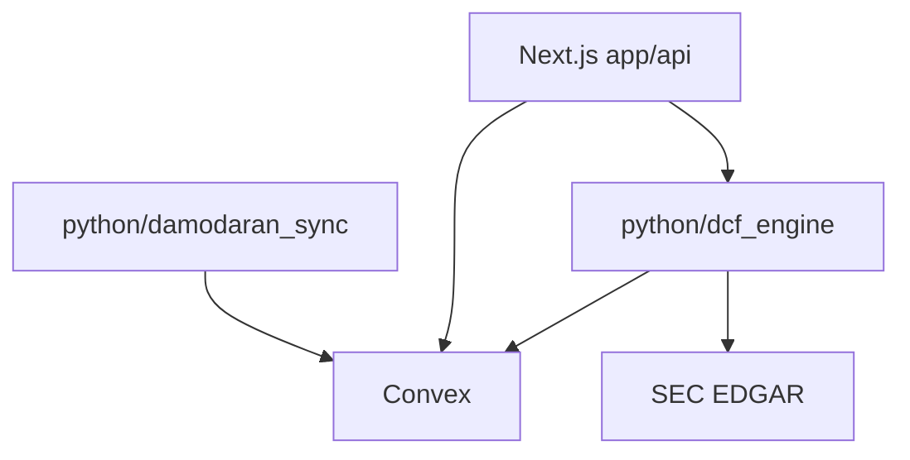
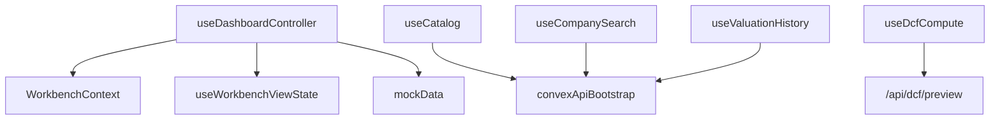
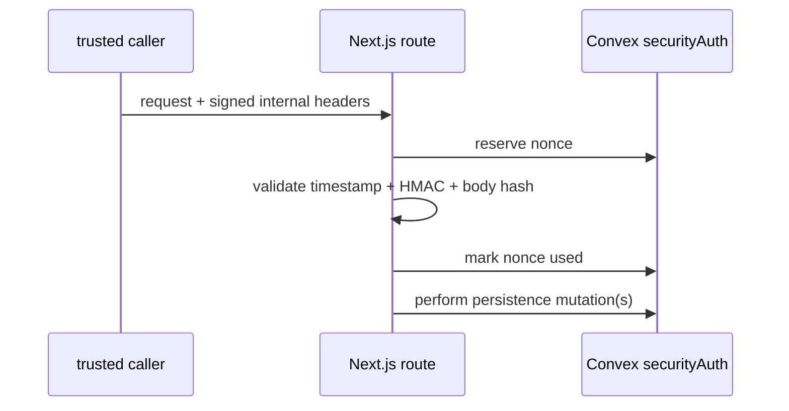

# DCF Dashboard - Codebase Map

> Current, code-backed map of the DCF Dashboard repository.
> Refreshed: 2026-03-02.
> For field- and model-level detail, see `DATA_MODEL.md`.

---

## Table of Contents

1. [Project Overview](#1-project-overview)
2. [System Architecture](#2-system-architecture)
3. [Directory Map](#3-directory-map)
4. [Data Model Overview](#4-data-model-overview)
5. [Component Deep Dives](#5-component-deep-dives)
   - 5a. [Frontend (Next.js)](#5a-frontend-nextjs)
   - 5b. [Convex Database](#5b-convex-database)
   - 5c. [DCF Engine (Python)](#5c-dcf-engine-python)
   - 5d. [Damodaran Sync (Python)](#5d-damodaran-sync-python)
6. [Dependency Graphs](#6-dependency-graphs)
7. [API Surface Catalog](#7-api-surface-catalog)
8. [Security Architecture](#8-security-architecture)
9. [Testing Strategy](#9-testing-strategy)
10. [Onboarding Guide](#10-onboarding-guide)

---

## 1. Project Overview

DCF Dashboard is a discounted cash flow workbench with four main parts:

- A Next.js frontend shell for exploring companies, scenarios, and valuation
  outputs.
- A Convex backend that stores Damodaran reference data, SEC caches, sync
  operational state, and valuation history.
- A Python DCF engine that normalizes assumptions, runs forecasts, discounts
  cash flows, and returns workbench responses.
- A Python Damodaran sync pipeline that discovers, downloads, parses,
  transforms, and uploads reference datasets.

Current operating mode note:

- The frontend shell is still mock-first in several places. The page controller
  composes mock datasets, price history, and run history from
  `lib/workbench/mockData.ts`, while live Convex hooks and live API routes also
  exist beside it.

### Tech Stack

| Layer | Technology |
|-------|-----------|
| Frontend framework | Next.js App Router |
| UI library | React |
| Frontend language | TypeScript |
| Styling | CSS Modules + global CSS variables |
| Database / BaaS | Convex |
| Backend language | Python 3.12+ |
| Python API framework | FastAPI |
| Python data validation | Pydantic v2 |
| JS/TS test runner | Bun |
| Python test runner | pytest |
| E2E | Playwright |

---

## 2. System Architecture



### Key Architectural Decisions

| Decision | Why it matters |
|----------|----------------|
| Convex is the integration boundary | `damodaran_sync` and `dcf_engine` communicate through Convex contracts rather than importing each other. |
| Build ID replacement for table data | Readers only see rows for the active build of a snapshot; incomplete rebuilds stay hidden. |
| Mock-first dashboard shell | The UI can render and be tested without live backend data. |
| Split client state | Domain state lives in `WorkbenchContext`; shell-only UI state lives in `useWorkbenchViewState()`. |
| Signed internal persistence requests | Next.js persistence routes use signed headers plus nonce replay protection before writing to Convex. |

---

## 3. Directory Map

| Path | Purpose |
|------|---------|
| `app/` | Next.js App Router pages, providers, API routes, fonts, global styles |
| `components/` | React components grouped into `layout/`, `workspace/`, `charts/`, and `ui/` |
| `lib/` | Client state, hooks, design tokens, utilities, mock workbench data |
| `convex/` | Convex schema, queries, mutations, auth helpers, maintenance flows |
| `convex_tests/` | Bun unit tests focused on Convex logic |
| `test/` | Bun integration and route tests for Next.js-side logic |
| `e2e/` | Playwright end-to-end tests |
| `python/dcf_engine/` | Core DCF engine, workbench models, reference lookup, FastAPI service, persistence |
| `python/damodaran_sync/` | Damodaran sync discovery, download, parse, transform, upload pipeline |
| `python/tests/` | pytest suite for Python engine and sync code |
| `documentation/` | Primary top-level project docs, including this codebase map |
| `docs/` | Additional docs; currently used much more lightly than `documentation/` |
| `.agent/` | Execution plans and agent-specific planning material |
| `.github/workflows/` | CI and scheduled sync workflows |

---

## 4. Data Model Overview

The Convex schema currently defines 23 tables.

### Table Groups

| Group | Tables |
|-------|--------|
| Reference | `categories`, `regions`, `datasets`, `datasetMappings` |
| Snapshot + row storage | `snapshots`, `tableData` |
| Fundamentals cache | `companies`, `companyStatements`, `rateLimits` |
| Sync operations | `syncLogs`, `syncLogIncrements`, `syncManifests`, `syncErrors`, `assets`, `auditLogs` |
| Maintenance | `duplicateScanState`, `duplicateCleanupState`, `duplicateSnapshotGroups`, `duplicateAssetGroups` |
| Security | `securityNonces`, `securityRateBuckets` |
| Valuation history | `valuationRuns`, `valuationRunTraces` |

### Core Relationship Sketch



For field- and index-level detail, use `convex/schema.ts` and `DATA_MODEL.md`.

---

## 5. Component Deep Dives

### 5a. Frontend (Next.js)

#### Current Shell Layout



#### App Router Files

| File | Purpose |
|------|---------|
| `app/layout.tsx` | Root HTML layout |
| `app/providers.tsx` | Wraps the app in `ThemeProvider`, `WorkbenchProvider`, and optionally `ConvexProvider` |
| `app/page.tsx` | Dashboard shell with docked rails and mobile drawers |
| `app/globals.css` | Global reset, theme variables, and shared styles |
| `app/fonts.ts` | Local font setup |
| `app/charts-test/page.tsx` | Dev page for chart experiments |

#### Component Inventory

| Area | Files |
|------|------|
| Layout | `components/layout/TopBar.tsx`, `LeftRail.tsx`, `RightPanel.tsx` |
| Workspace | `ScenarioTabs.tsx`, `ScenarioChips.tsx`, `ValueCard.tsx`, `MetricsTable.tsx`, `SensitivitySection.tsx`, skeleton variants |
| Charts | `DistributionCurve.tsx`, `SensitivityHeatmap.tsx`, `Sparkline.tsx` |
| UI primitives | `Drawer.tsx`, `Accordion.tsx`, `Pagination.tsx`, `SearchOverlay.tsx`, `Slider.tsx`, theme/error helpers |

#### Hooks

| File | Current role |
|------|--------------|
| `lib/hooks/useDashboardController.ts` | Mock-first shell controller. Composes `WorkbenchContext`, `useWorkbenchViewState()`, and mock data. |
| `lib/hooks/useDcfCompute.ts` | Debounced compute hook that posts to `/api/dcf/preview`. |
| `lib/hooks/useCompanySearch.ts` | Convex company search hook with debounce. |
| `lib/hooks/useValuationHistory.ts` | Convex valuation history hooks (`listByTicker` and `listBySymbol`). |
| `lib/hooks/useCatalog.ts` | Convex sidebar catalog hook via `catalog:getSidebar`. |
| `lib/hooks/useDialogInteractions.ts` | Dialog interaction helpers. |
| `lib/hooks/useWorkbenchViewState.ts` | UI-only state for mode and drawers. |
| `lib/hooks/convexApiBootstrap.ts` | Client bootstrap/fallback loading for Convex API references. |
| `lib/hooks/dashboardControllerTiming.ts` | Timing helpers used by the dashboard controller. |

#### State Containers

| File | Shape |
|------|-------|
| `lib/contexts/WorkbenchContext.tsx` | Selected company/run, active scenario, per-scenario assumptions, result, loading, error |
| `lib/contexts/ThemeContext.tsx` | `{ theme, toggleTheme }` persisted to local storage |
| `lib/hooks/useWorkbenchViewState.ts` | `viewMode`, `activeDrawer`, shell callbacks |

#### Important frontend caveat

- Live hooks and API routes exist, but the current dashboard page still renders
  from mock catalog/run data in the controller. Documentation and future work
  should avoid presenting the shell as fully live-data-driven yet.

### 5b. Convex Database

#### Build ID Lifecycle



Key invariant:

- Queries must join row reads to the snapshot's `activeBuildId` so readers never
  see partial rebuild data.

#### Convex Module Inventory

| File | Current exports / role |
|------|------------------------|
| `schema.ts` | Source of truth for validators, indexes, and table definitions |
| `snapshots.ts` | Snapshot queries plus `upsertByIdentity`, `finalizeRebuild`, `clearRebuilding`, `markPrimaryKeyNormComplete` |
| `tableData.ts` | Row queries plus batch insert/delete/backfill mutations |
| `valuations.ts` | Create, attach trace, fetch, list-by-symbol, list-by-ticker |
| `companies.ts` | `get`, `search`, `upsertCompany`, `backfillSearchTextPage` |
| `companyStatements.ts` | `listBySymbol`, `upsertBatch` |
| `syncLogs.ts` | `create`, `increment`, `finish`, `listRecent` |
| `syncErrors.ts` | `append`, `listBySyncLogId` |
| `syncManifests.ts` | `getLatest`, `upsert` |
| `assets.ts` | `record`, `recordBatch` |
| `catalog.ts` | `getSidebar` |
| `reference.ts` | `getLatestSnapshot`, `getSnapshotAtOrBefore`, `getRow` |
| `industries.ts` | `search` |
| `metrics.ts` | `getCounts` |
| `seed.ts` | `upsertAll`, `getReference` |
| `rateLimits.ts` | shared fixed-window limiter mutation `check` |
| `securityAuth.ts` | nonce reservation / mark-used / release-pending mutations |
| `securityRateLimit.ts` | security bucket limiter mutation `hitBucket` |
| `syncAuth.ts` | timing-safe sync token validation |
| `maintenance.ts` | re-exports duplicate scan, cleanup, pruning, and backfill operations |
| `maintenance/` | scan/cleanup/pruning internals and logic helpers |

### 5c. DCF Engine (Python)

#### Pipeline



#### Core Package Inventory

| Area | Files / symbols |
|------|-----------------|
| Core engine | `schema.py`, `engine.py`, `normalization.py`, `forecast.py`, `discounting.py`, `bridge.py`, `schedules.py`, `validation.py` |
| CLI + I/O | `cli.py`, `io/config_loader.py`, `io/export.py` |
| Workbench | `workbench/schema.py`, `run.py`, `build_inputs.py`, `kpis.py`, `monte_carlo.py` |
| Reference lookup | `reference/provider.py`, `reference/convex_provider.py`, `reference/profiles/*.py` |
| FastAPI service | `service/app.py`, `sec_edgar.py`, `sec_edgar_http.py`, `sec_edgar_cache.py`, `sec_edgar_extract.py`, `sec_edgar_models.py` |
| Persistence | `persist/convex_runs.py` |

#### Current behavior notes

- The CLI uses `argparse`, not Click.
- Reference resolution is selector-driven via `ReferenceSelector` and
  `ConvexReferenceProvider`, not by a hard-coded company-to-industry bridge.
- Persistence is handled by `ConvexRunPersister.save()`.

### 5d. Damodaran Sync (Python)

#### Pipeline



#### Package Inventory

| File | Current role |
|------|--------------|
| `sync.py` | Main orchestration; public entry point is `process_page()` |
| `cli.py` | `argparse` CLI with `seed`, `sync-current`, `sync-all`, cleanup, backfill, and validation commands |
| `discover.py` | Page scraping and asset/date discovery |
| `download.py` | GET/HEAD client, retry logic, cache-aware download and probing |
| `excel_parse.py` | Sheet selection and header-row detection |
| `transform.py` | Normalization into uploadable row payloads and storage metadata |
| `mapping_resolver.py` | Dataset and region resolution from filenames and rules |
| `sync_resolution.py` | `ResolvedAsset` construction and asset-record building |
| `sync_batching.py` | Payload-size-aware insert batching |
| `convex_client.py` | Convex HTTP wrapper for snapshot, row, log, and cleanup operations |
| `convex_client_models.py` | `SnapshotUpsertResult` |
| `convex_client_validation.py` | Convex response validators |
| `config.py` | sync env/config helpers |
| `date_parser.py` | label and filename date parsing |
| `dataset_mappings*.py` | seeded categories/datasets/mappings and validation |
| `mirror.py` | manifest-based mirror fetch support |
| `sync_legacy.py` | legacy helpers retained for compatibility |

#### Skip and change-detection logic

The sync pipeline can skip or short-circuit on:

1. Manifest hash match for a page.
2. Snapshot identity already ready and unchanged.
3. Conditional HEAD/GET checks using ETag or Last-Modified metadata.
4. Same file hash after download.

---

## 6. Dependency Graphs

### Cross-Module Boundary



### Frontend State Dependencies



---

## 7. API Surface Catalog

### Next.js API Routes (`app/api/`)

| Method | Path | Purpose |
|--------|------|---------|
| `POST` | `/api/dcf/run` | Calls FastAPI `/dcf/compute`; persists to Convex only when the request passes internal signed-header auth |
| `POST` | `/api/dcf/preview` | Calls FastAPI `/dcf/compute` without persistence and with `includeTrace: false` |
| `GET` | `/api/company/search` | Searches Convex first, then falls back to EDGAR |
| `GET` | `/api/company/facts` | Fetches EDGAR facts only |
| `POST` | `/api/company/facts` | Signed internal route that fetches EDGAR facts and persists them to Convex |

### FastAPI Service Endpoints

| Method | Path | Purpose |
|--------|------|---------|
| `GET` | `/sec/search` | Company search passthrough to EDGAR helpers |
| `GET` | `/sec/facts` | Company facts extraction for one ticker |
| `POST` | `/dcf/compute` | Runs the workbench valuation pipeline |

### Convex Queries

| Query | File |
|-------|------|
| `companies:get`, `companies:search` | `companies.ts` |
| `companyStatements:listBySymbol` | `companyStatements.ts` |
| `catalog:getSidebar` | `catalog.ts` |
| `reference:getLatestSnapshot`, `reference:getSnapshotAtOrBefore`, `reference:getRow` | `reference.ts` |
| `snapshots:getByIdentity`, `snapshots:getById`, `snapshots:getByIdentityBatch`, `snapshots:listByDatasetRegion`, `snapshots:listRebuilding` | `snapshots.ts` |
| `tableData:listBySnapshot` | `tableData.ts` |
| `valuations:get`, `valuations:listBySymbol`, `valuations:listByTicker` | `valuations.ts` |
| `syncLogs:listRecent` | `syncLogs.ts` |
| `syncErrors:listBySyncLogId` | `syncErrors.ts` |
| `syncManifests:getLatest` | `syncManifests.ts` |
| `industries:search` | `industries.ts` |
| `metrics:getCounts` | `metrics.ts` |
| `seed:getReference` | `seed.ts` |
| duplicate scan/cleanup state queries | `maintenance/duplicateScan.ts`, `maintenance/duplicateCleanup.ts` |

### Convex Mutations

| Mutation | File |
|----------|------|
| `snapshots:clearRebuilding`, `snapshots:upsertByIdentity`, `snapshots:finalizeRebuild`, `snapshots:markPrimaryKeyNormComplete` | `snapshots.ts` |
| `tableData:insertBatch`, `tableData:deleteBySnapshotBuild`, row cleanup/backfill mutations | `tableData.ts` |
| `valuations:create`, `valuations:attachTrace` | `valuations.ts` |
| `companies:upsertCompany`, `companies:backfillSearchTextPage` | `companies.ts` |
| `companyStatements:upsertBatch` | `companyStatements.ts` |
| `syncLogs:create`, `syncLogs:increment`, `syncLogs:finish` | `syncLogs.ts` |
| `syncErrors:append` | `syncErrors.ts` |
| `syncManifests:upsert` | `syncManifests.ts` |
| `assets:record`, `assets:recordBatch` | `assets.ts` |
| `seed:upsertAll` | `seed.ts` |
| `rateLimits:check` | `rateLimits.ts` |
| `securityAuth:reserveNonce`, `securityAuth:markNonceUsed`, `securityAuth:releasePendingNonce` | `securityAuth.ts` |
| `securityRateLimit:hitBucket` | `securityRateLimit.ts` |
| maintenance scan, cleanup, pruning, and backfill mutations | `maintenance.ts` and `maintenance/*` |

---

## 8. Security Architecture

### Security Layers

| Layer | Mechanism | Location |
|-------|----------|---------|
| Convex write auth | `requireSyncToken()` with timing-safe UTF-8 comparison | `convex/syncAuth.ts` |
| Next.js route persistence auth | HMAC over method, path, timestamp, nonce, and body hash | `app/api/_lib/internalAuth.ts` |
| Nonce replay protection | Nonce reservation / mark-used / release flow backed by `securityNonces` | `app/api/_lib/internalAuth.ts`, `convex/securityAuth.ts` |
| Next.js route rate limiting | Trusted-client-IP extraction plus `securityRateLimit:hitBucket` | `app/api/_lib/rateLimit.ts`, `convex/securityRateLimit.ts` |
| Shared server-side counters | Fixed-window counters in `rateLimits` | `convex/rateLimits.ts` |
| FastAPI shared security client | Convex-backed nonce and rate-limit operations for FastAPI | `python/dcf_engine/service/convex_security.py` |
| FastAPI replay protection | HMAC verification plus Convex-backed nonce reserve/mark-used/release | `python/dcf_engine/service/internal_auth.py`, `convex/securityAuth.ts` |
| FastAPI compute rate limiting | Convex-backed fixed-window limiter keyed by trusted client identity | `python/dcf_engine/service/app.py`, `convex/securityRateLimit.ts` |
| Trusted proxy handling | Socket-IP default; `x-forwarded-for` only from allowlisted proxies | `python/dcf_engine/service/app.py` |
| Audit events | `auditLogs` table exists for operational auditing | `convex/schema.ts` and selected mutations |

### Internal Persistence Flow



Important clarification:

- The signed internal headers protect Next.js persistence routes such as
  `POST /api/dcf/run` persistence and `POST /api/company/facts`.
- Next.js to FastAPI calls use `fetchDcfEngine()` and `DCF_ENGINE_URL`; they are
  not protected by the same signed-header flow.

---

## 9. Testing Strategy

### Test Pyramid

| Layer | Runner | Current count | Location |
|-------|--------|---------------|---------|
| Python unit/integration | pytest | 26 test files | `python/tests/` |
| Convex logic | Bun | 8 test files | `convex_tests/` |
| Next.js route/client logic | Bun | 14 test files | `test/` |
| End-to-end | Playwright | 4 test files | `e2e/` |

### Current Test Buckets

| Area | Examples |
|------|----------|
| Engine math and normalization | `test_bridge.py`, `test_discounting.py`, `test_engine_smoke.py`, `test_normalization_reference.py` |
| Workbench and persistence | `test_workbench_monte_carlo.py`, `test_persist_convex_runs.py` |
| EDGAR and service routes | `test_sec_edgar.py`, `test_service_app_sec_routes.py` |
| Sync pipeline | `test_convex_client.py`, `test_dataset_mappings.py`, `test_download_conditional.py`, `test_sync_process_page.py`, `test_transform.py` |
| Convex auth and maintenance | `syncAuth.test.ts`, maintenance logic tests, `snapshots_helpers.test.ts` |
| Next.js API and client logic | `companyFactsRoute.test.ts`, `dcfRunRouteAuth.test.ts`, `internalAuth.test.ts`, `rateLimitRoutes.test.ts`, `useDcfCompute.test.ts` |
| E2E shell coverage | `assumptions.pw.ts`, `dashboard.pw.ts`, `mobile_drawers.pw.ts`, `visual.pw.ts` |

### CI Workflows

| Workflow | Role |
|----------|------|
| `ci.yml` | Main verification pipeline |
| `codespell.yml` | Spell checking |
| `damodaran-weekly-sync.yml` | Scheduled sync workflow |

---

## 10. Onboarding Guide

This section is intentionally short and operational. Use `AGENTS.md` for repo
workflow rules and `DATA_MODEL.md` for the lower-level contracts behind these
systems.

### Prerequisites

| Tool | Check |
|------|-------|
| Node.js | `node --version` |
| npm | `npm --version` |
| Python 3.12+ | `python3 --version` |
| Bun | `bun --version` |

### First-Time Setup

```bash
npm install
pip install -r python/requirements.txt
```

Environment variables commonly needed:

- `CONVEX_URL`
- `NEXT_PUBLIC_CONVEX_URL`
- `DAMODARAN_SYNC_TOKEN`
- `DCF_ENGINE_URL`
- `INTERNAL_PERSISTENCE_KEY`

### Local Development

```bash
# Convex
bunx convex dev

# Next.js app
npm run dev

# Python DCF CLI
cd python && python -m dcf_engine.cli run --config path/to/config.yaml

# Damodaran sync
cd python && python -m damodaran_sync.cli sync-current
```

### Verification Commands

```bash
bun test convex_tests
bun test test
cd python && pytest
bunx convex typecheck
```

### Quick Reference

| What you want | Where to look |
|---------------|---------------|
| Convex table definitions | `convex/schema.ts` |
| Snapshot rebuild logic | `convex/snapshots.ts`, `convex/tableData.ts` |
| Duplicate maintenance | `convex/maintenance.ts`, `convex/maintenance/` |
| DCF engine core models | `python/dcf_engine/schema.py` |
| Workbench API models | `python/dcf_engine/workbench/schema.py` |
| FastAPI endpoints | `python/dcf_engine/service/app.py` |
| Run persistence | `python/dcf_engine/persist/convex_runs.py` |
| Sync orchestration | `python/damodaran_sync/sync.py` |
| Sync CLI | `python/damodaran_sync/cli.py` |
| Frontend domain state | `lib/contexts/WorkbenchContext.tsx` |
| Frontend shell state | `lib/hooks/useWorkbenchViewState.ts` |
| Primary project docs | `documentation/` |
